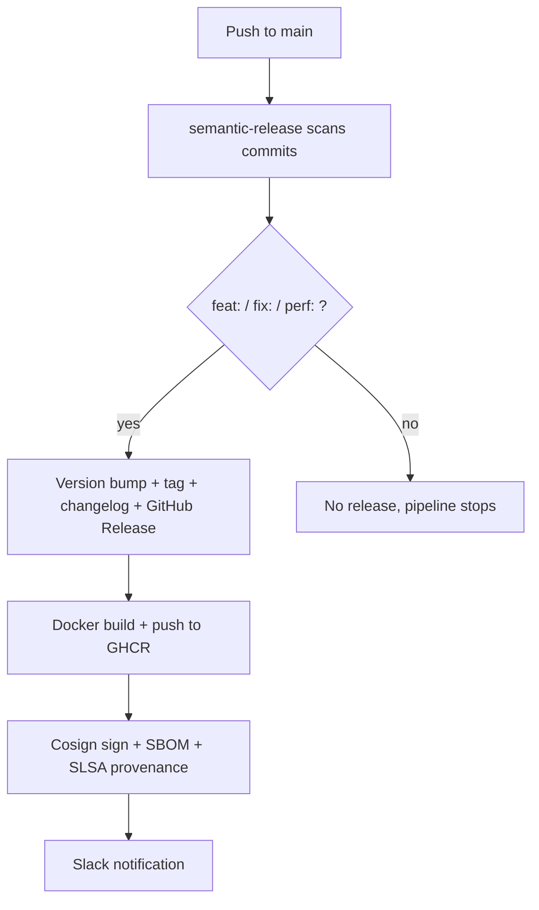

# Secure Reusable Release Pipeline

Reusable GitHub Actions workflow for automating the release cycle of Docker applications with a focus on supply chain security.

## How It Works



Commits must follow [Conventional Commits](https://www.conventionalcommits.org/) – without a recognized prefix (`feat:`, `fix:`, `perf:`, etc.) semantic-release won't create a release and the rest of the pipeline won't run.

## What's Inside

| Stage | Tool | What it does |
|---|---|---|
| Versioning | [semantic-release](https://github.com/semantic-release/semantic-release) | Version bump, changelog, GitHub Release from commit history |
| Build | [docker/build-push-action](https://github.com/docker/build-push-action) + [Buildx](https://docs.docker.com/build/buildx/) | Image build, OCI metadata, push to GHCR |
| Image signing | [Cosign](https://docs.sigstore.dev/cosign/overview/) (keyless via OIDC) | Digest signing with no key management |
| SBOM | [Syft](https://github.com/anchore/syft) (SPDX) | Dependency inventory of the container |
| Provenance | [actions/attest-build-provenance](https://github.com/actions/attest-build-provenance) | Cryptographic build attestation, [SLSA L3](https://slsa.dev/spec/v1.0/levels) |
| Notifications | [action-slack](https://github.com/8398a7/action-slack) | Deploy status to Slack |

## Structure

```
.github/workflows/
├── release.yml    # Core reusable workflow (workflow_call)
└── deploy.yml     # Example caller workflow
.releaserc.json    # semantic-release config
```

## Usage

Create `.github/workflows/release.yml` in your repository:

```yaml
name: Release

on:
  push:
    branches:
      - main

jobs:
  call-secure-release:
    uses: idipi/release-workflow/.github/workflows/release.yml@main
    with:
      image_name: ${{ github.repository }}
      dockerfile_path: 'Dockerfile'
    secrets:
      SLACK_WEBHOOK_URL: ${{ secrets.SLACK_WEBHOOK_URL }}
```

### Inputs

| Parameter | Required | Default | Description |
|---|---|---|---|
| `image_name` | yes | – | Image name, e.g. `my-org/my-app` |
| `dockerfile_path` | no | `Dockerfile` | Path to Dockerfile |
| `context_path` | no | `.` | Docker build context |
| `node_version` | no | `20` | Node.js version for semantic-release |

### Secrets

| Secret | Required | Description |
|---|---|---|
| `SLACK_WEBHOOK_URL` | no | Webhook for Slack notifications |

## Requirements

- Commits following [Conventional Commits](https://www.conventionalcommits.org/) – `feat:`, `fix:`, `perf:` trigger a release; everything else is ignored
- `Dockerfile` in the repository
- GitHub Actions permissions: `contents: write`, `packages: write`, `id-token: write`, `attestations: write`

## References

- [Reusable workflows](https://docs.github.com/en/actions/sharing-automations/reusing-workflows) – how `workflow_call` works in GitHub Actions
- [Sigstore](https://www.sigstore.dev/) – keyless signing, Fulcio, Rekor
- [SLSA](https://slsa.dev/) – supply chain security levels
- [Conventional Commits](https://www.conventionalcommits.org/) – commit message specification
